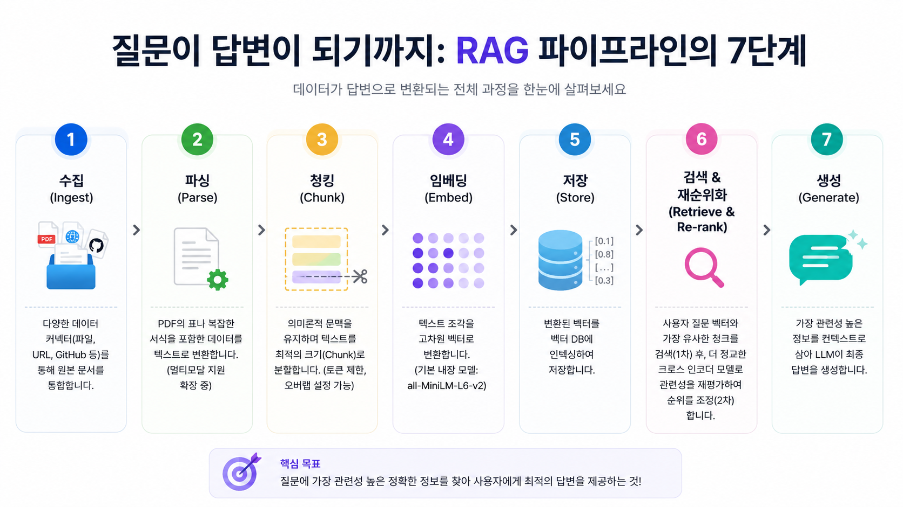
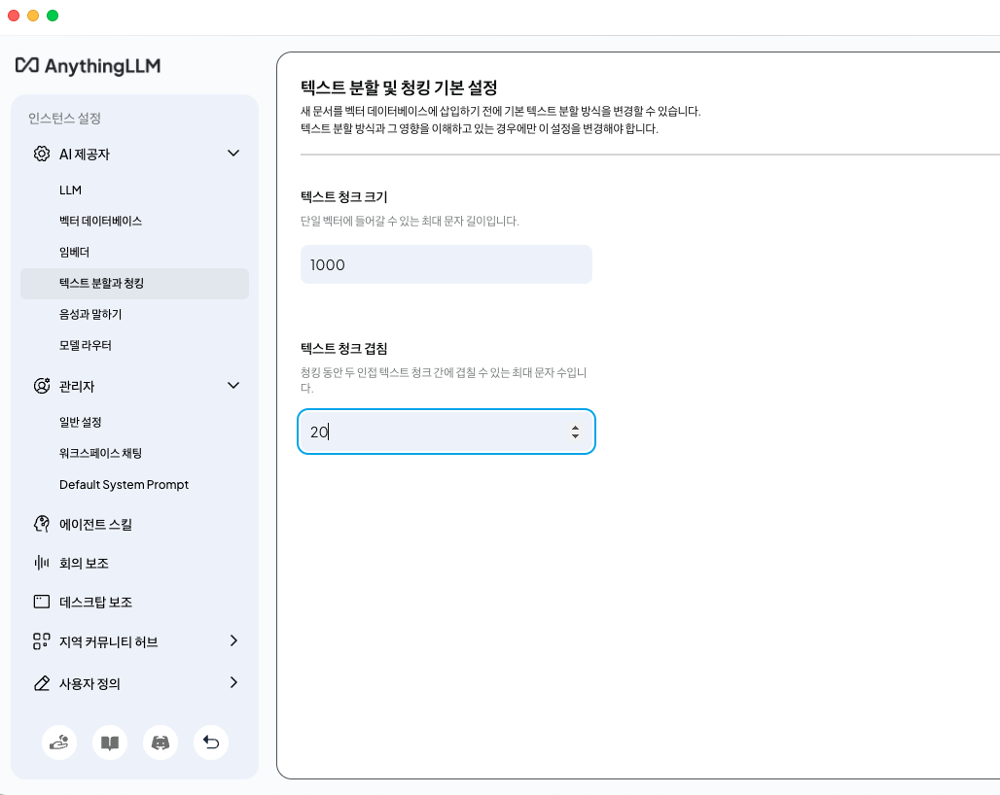
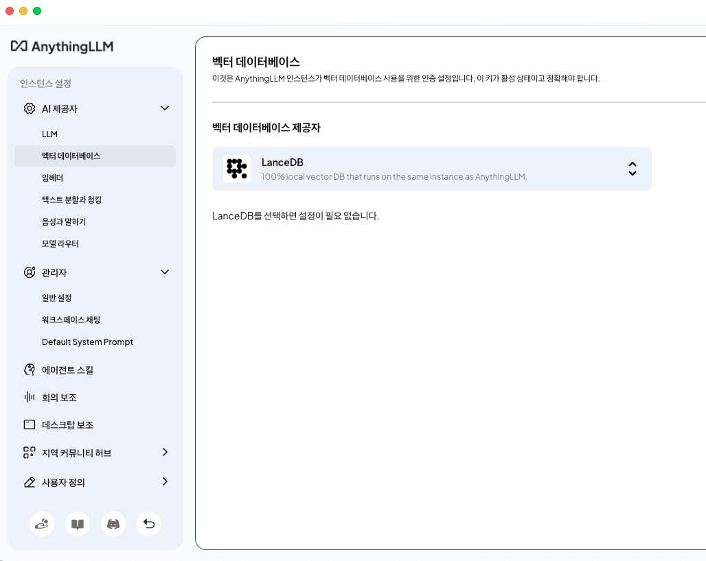

RAG는 "학습"이 아니라 "오픈북 시험에서 참고자료를 꺼내주는 시스템"이라고 이해하면 된다.
로컬 LLM과 RAG를 제대로 사용하려면 '저장 및 임베딩(Save and Embed)'이 실제로 무엇을 하는지 이해하는 게 중요하다. 많은 사람들이 "저장 및 임베딩 == AI가 문서를 학습한다"라고 오해하곤 한다.


'저장 및 임베딩'은 문서를 검색하기 좋게 변환해서 벡터DB에 저장하는 과정, 검색용 색인을 만드는 것이다. 앞으로 RAG를 설명할 때 아래 예시 구조로 설명할 것이다.

<설명 예시 구조>
```
AnythingLLM -> 저장 및 임베딩 -> LanceDB(Vector DB) -> 질문 -> 벡터 검색 -> Qwen(Ollama) -> 답변 생성
```

# 1. 저장(Save)
'test.md' 텍스트파일이 있다.
```
# NAT Instance 구축기

1. ip_forward 설정
2. sysctl -p 적용
3. MASQUERADE 설정
   
바나나고양이1234
```

test.md 파일을 AnythingLLM에 저장하면 파일 위치, 파일명, 본문, 메타데이터를 AnythingLLM이 관리한다. 아직 AI가 내용까지는 이해하지 못하는 상황이다.
```
{  
	"filename":"test.md",
	"workspace":"Obsidian",
	"content":"ip_forward..."
}
```

# 2. 텍스트 추출
```
# NAT Instance 구축기

ip_forward
sysctl -p
MASQUERADE

바나나고양이1234
```

↓   AnythingLLM이 test.md 파일 내용을 읽어서 순수 텍스트로 변환합니다.

```
NAT Instance 구축기
ip_forward
sysctl -p
MASQUERADE
바나나고양이1234
```

# 3. 텍스트 분할(Text Splitting)
문서가 길면 그대로 AI, 예시에서는 Qwen에게 순수 텍스트를 주지 않고 Chunk 단위로 나눠서 보낸다.
Qwen에게 100페이지를 한번에 모든 텍스트를 보내면 느리거나 메모리가 부족하거나 Context Window가 초과될 수 있기 때문에 Chunck 단위로 잘게 나눈다.

# 4. 청킹(Chunking)
나눌 때에는 기준이 있다.  AnythingLLM에서는 '설정-인스턴스 설정-AI 제공자-텍스트 분할과 청킹' 메뉴에서 단위를 설정할 수 있다.


예를 들어, Chunk Size가 1000, Overlap이 20이라면 일부 겹치게 해서 글자를 가져오게 됩니다.
```
Chunk Size : 1000
Overlap : 20

[청크]
1~1000자 (chunk size)
980~1980자 (-20 + chunck size)
1960~2960자 (-20 + chunck size)
```

오버랩 없이 겹치지 않고 글자를 가져오게 되면 문맥을 알 수 없어 청크 전, 후의 상황을 알 수 없게 됩니다.

# 5. 임베딩(Embedding)
임베더는 문장을 숫자 벡터로 변환하는 과정이다.AnythingLLM 설정-인스턴스 설정-AI제공자-임베더 메뉴를 클릭하면 아래 화면이 나오게 된다.
![[./images/06_01_02_02_01_3.png]]

예시를 보자면 'sysctl -p 적용'이라는 텍스트를 숫자의 벡터로 변환한다.
```
sysctl -p 적용
```
↓
```
[0.234,
0.984,
0.223,
...384개 숫자]
```

'저장 및 임베딩'은 Qwen이 학습했다고 생각하면 안되고, 검색용 인덱스를 생성한다고 생각해야 한다.
Qwen 모델 파일(.gguf)은 전혀 바뀌지 않는다.
예를 들어 텍스트 파일에 '내 ISA 계좌 잔액은 1000만원이다.' 라는 내용을 넣고 임베딩을 하면 Qwen이 영구적으로 기억하는 것이 아니라, 질문할 때마다 임베더가 벡터를 생성
```
임베더 벡터DB 생성
↓
AnythingLLM이 관련 문서 검색 후 Qwen에게 참고자료를 전달
```
하는 방식으로 답변하는 것이다.

# 6. 벡터DB 저장

AnythingLLM은 설정-인스턴스 설정-AI제공자-벡터 데이터베이스 메뉴로 가면 확인이 가능하다.
기본적으로 LanceDB로 설정되어 있다.
LanceDB에는 임베더한 벡터들이 저장된다.

| Chunk | 내용          | Vector     |
| ----- | ----------- | ---------- |
| 1     | NAT Gateway | [0.23,...] |
| 2     | ip_forward  | [0.94,...] |
| 3     | sysctl -p   | [0.12,...] |

---

# 사용자가 질문하게 되면?
예를 들어서 사용자가 '내가 NAT 구축할 때 실수했던 건?' 질문을 한다면
```
내가 NAT 구축할 때 실수했던 건?
```

임베더가 질문을 벡터로 바꾼다.
```
내가 NAT 구축할 때 실수했던 건?
```
↓
```
[0.11,
0.94,
0.22,
...]
```

그리고 LanceDB에서 검색하게 된다.
질문의 벡터와 문서의 벡터 거리가 가까운 벡터를 찾게 되면 해당 Chunk를 가져온다.
```
Chunk3
sysctl -p 적용 안 함
```

마지막으로 AnythingLLM이 질문과 벡터 거리가 가까운 문서를 Qwen에게 전달하게 된다.
```
질문:
내가 NAT 구축할 때 실수했던 건?

참고문서:
sysctl -p 적용 안 함
```

Qwen은 해당 문서를 참고해서 답변을 생성한다.

```
소영님은 NAT Instance 구축 시
sysctl -p 적용을 누락했습니다.
```


### AnythinLLM의 각 메뉴의 역할

| 메뉴        | 역할       | 설정 예시            |
| --------- | -------- | ---------------- |
| LLM 제공자   | 답변 생성    | Ollama + Qwen    |
| 벡터 데이터베이스 | 벡터 저장소   | LanceDB          |
| 임베더       | 문장→벡터 변환 | all-MiniLM-L6-v2 |
| 텍스트 분할    | 문서를 자름   | Chunk Size       |
| 청킹        | 의미 단위 저장 | Overlap          |
