#RAG #AnythingLLM #Ollama #Qwen 

나는 Mac에서 구축하는 것을 참고한다.
# Homebrew로 Ollama 설치하기
1. 맥북 HomeBrew 에서 Ollama 설치하기
	 - 기본 Port : 11434
	  - 설치 파일 경로 : /opt/homebrew/opt
	  - DB 및 conf 및 캐시 경로 : /Users/<usr>/Library/Application Support/anythingllm-desktop
	```
	brew install ollama //ollama 설치하기
	brew uninstall ollama //ollama 삭제하기
	```
  
  2. 설치가 완료되면 ollama 서비스 실행하기
	```
	brew services start ollama //서비스 실행하기
	brew services stop ollama //서비스 중지하기
	```

  3. ollama 서비스 관련 명령어
	```
	  ollama //ollama 실행 명령어
	  ollama --version //ollama 버전 확인하기
	  ollama list //ollama에서 실행 중인 엔진 확인하기
	  brew services list | grep ollama //ollama 서비스가 brew에서 설치되 있는지 확인하기
	
	  curl http://localhost:11434/api/tags //ollama api 요청하기
	```

  4. ollama 포트가 LISTEN 중인지 확인하기
	```
	  % lsof -i :11434
	
	  COMMAND   PID   USER   FD   TYPE   DEVICE   SIZE/OFF   NODE   NAME
	  ollama    58055
	```

나는 qwen과 qwenCoder이 설치했다. 만약 추가 다른 엔진을 실행(Launch)하거나 설치(inatll)하고 싶다면 ollama를 실행해서 원하는 엔진을 실행하거나 설치하면 된다.

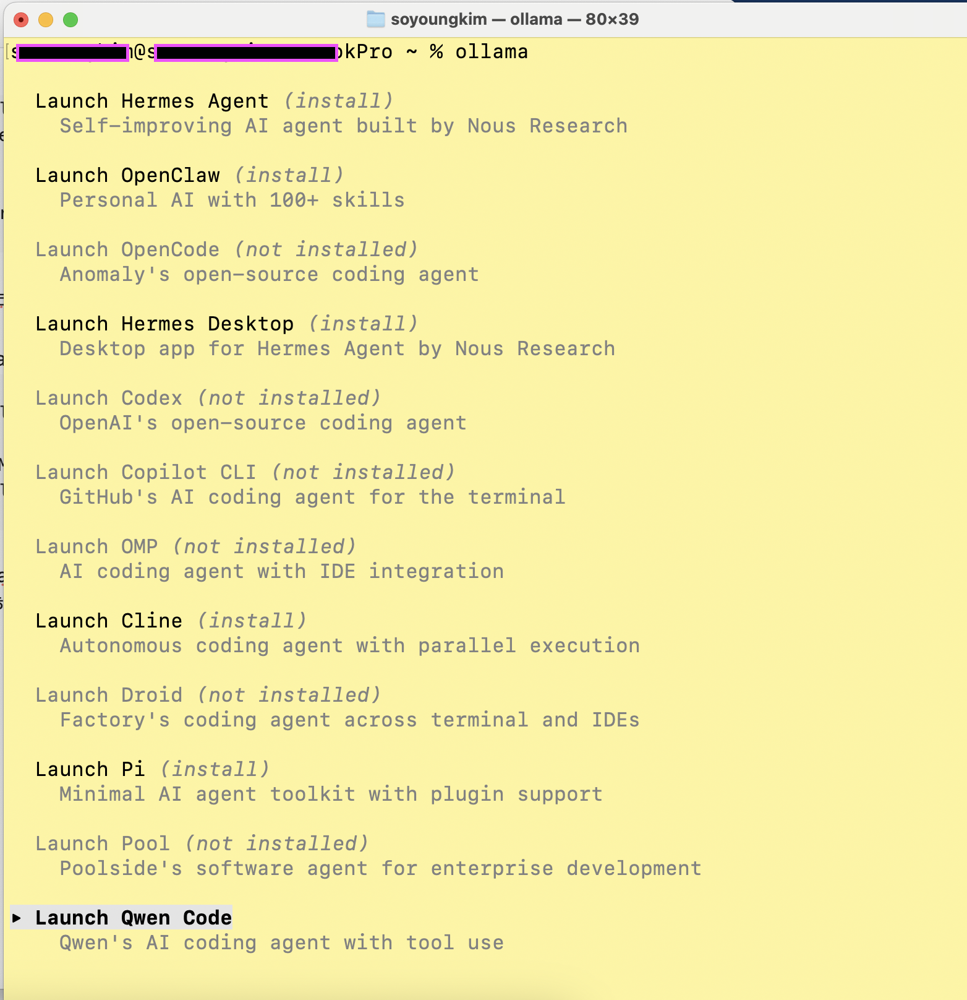

---

# AnythingLLM 어플리케이션 설치하기
  1. AI 인터페이스 AnythingLLM을 다운로드 및 설치한다.
	[AnythingLLM 다운로드](https://anythingllm.com/)

  2. MacOS에서 제거하기
	Application 폴더에서 Application을 휴지통에 넣는다.
	AnythingLLM 데스크톱 데이터를 시스템에서 완전히 제거하려면 '/Users/<usr>/Library/Application Support/anythingllm-desktop' 폴더도 삭제한다. 이 폴더에는 데이터베이스, 문서 및 벡터 캐시가 있습니다.

  3. AnythingLLM 어플리케이션 초기 설정은 Default 대로 해도 된다. 추후 설정 변경이 가능하다.
	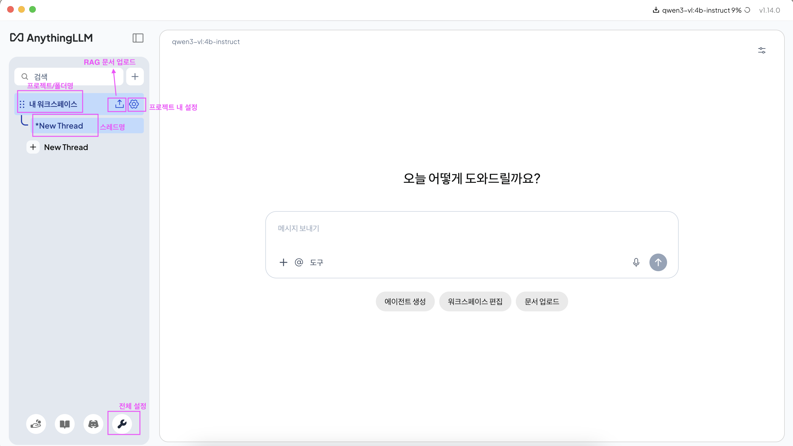

---

# AnythingLLM 초기 설정
  1. 우선 '익명 원격 분석 활성화' 비활성화 체크하기
	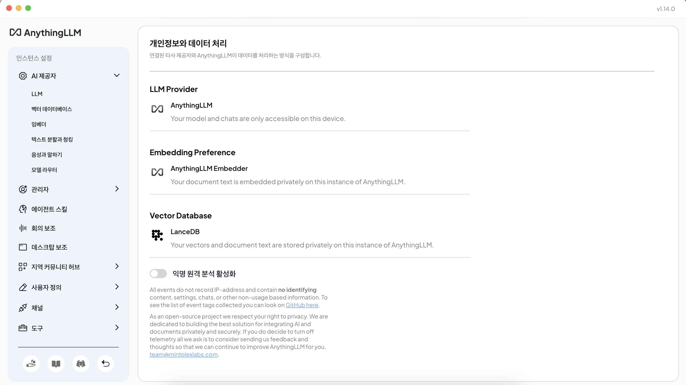

  2. LLM Provider 변경하기
	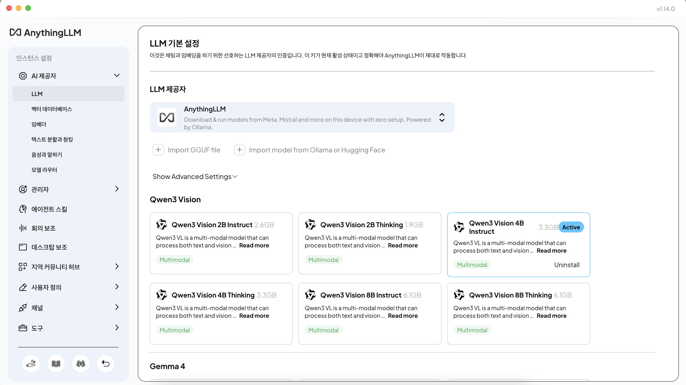
	AnythingLLM v1.14에서 제공하는 **내장 LLM 엔진(Built-in Provider)** 이다. 내부적으로 Ollama 기반 런타임을 사용하지만 사용자가 직접 Ollama 서버를 관리할 필요 없이 모델을 다운로드하고 실행할 수 있게 만든 형태이다. 하지만 나는 내부 구축한 Ollama으로 LLM Provider로 설정할 것이다.
	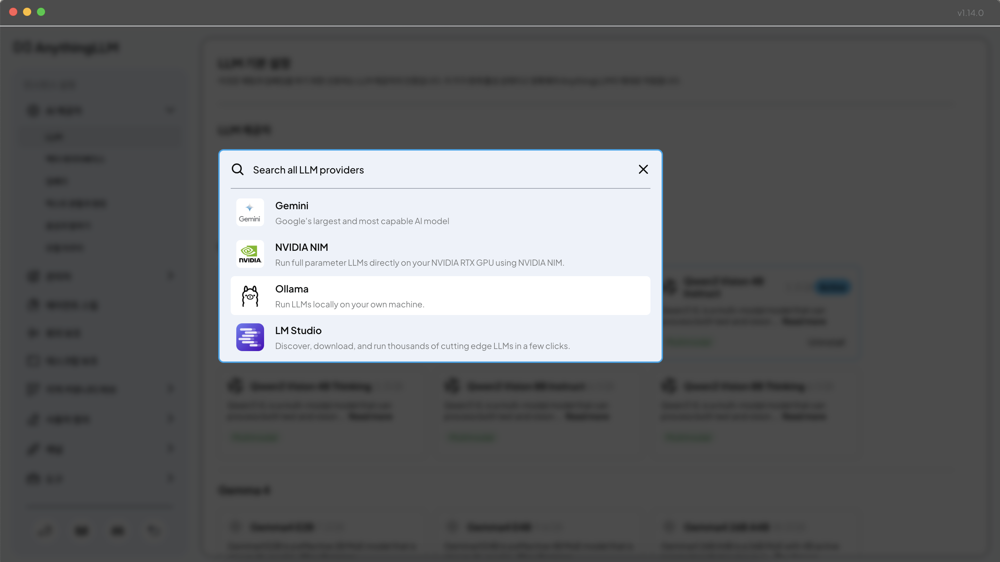
	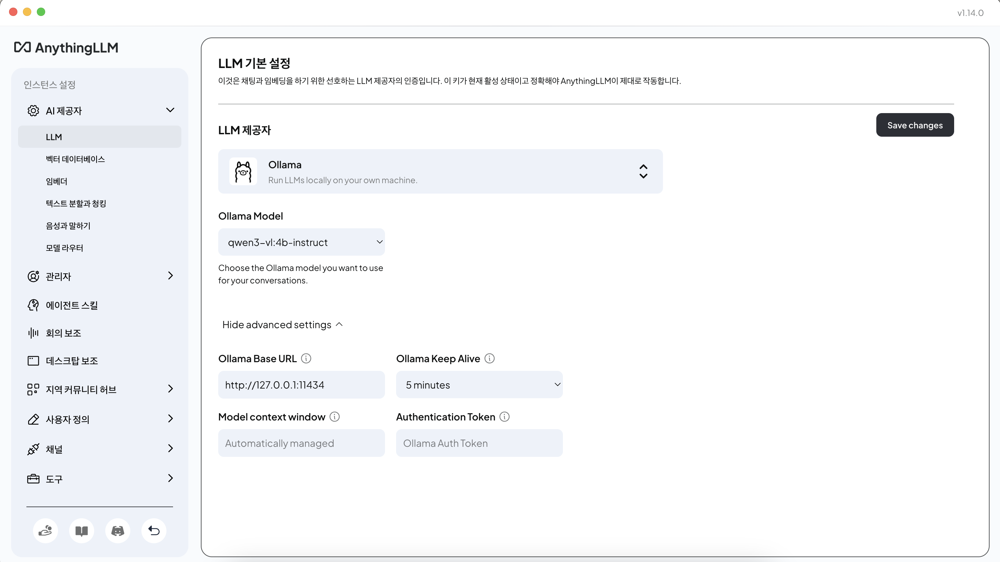

  3. 웹 서칭 설정 Off 하기
     이것은 내가 RAG 테스트를 위해 설정하는 것이다. 웹으로 검색하면 내가 임베딩한 문서가 우선으로 검색되지 않는 것 같아서다. 만약 문서 외 다른 정보 검색 시 웹 서칭 설정을 On 하면 된다.
	  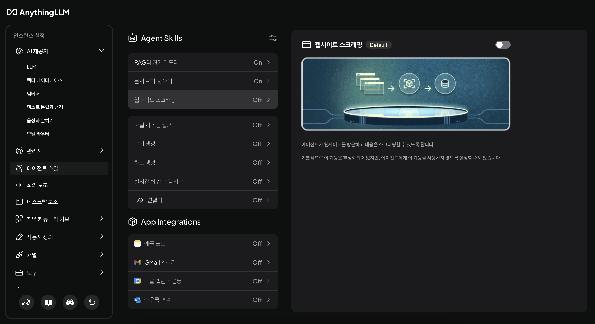

---

# 내가 검색할 정보가 들어간 문서 및 링크 업로드 및 임베딩하기

워크스페이스의 '문서 관리' 모달을 연다. '문서 관리' 모달에는 특정 문서나 링크의 정보를 AI에 학습시키고 있을 때 사용하면 된다. 만약 엔진이 학습한 정보만 검색하는 일반 서칭하는 것이라면 '문서 관리' 모달에서 굳이 정보 문건을 업로드할 필요는 없다.
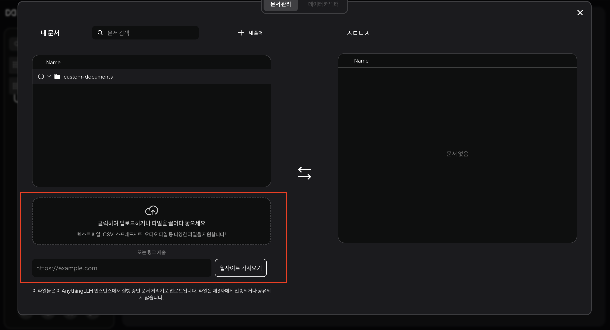

'문서관리' 모달의 왼쪽 하단에 1개의 문서 또는 링크 업로드하는 영역이 있다.
만약 여러 개 파일을 욜려야 하는 경우 업로드할 파일을 모두 선택 후 드래그하거나 상위 폴더를 드래그하면 된다.
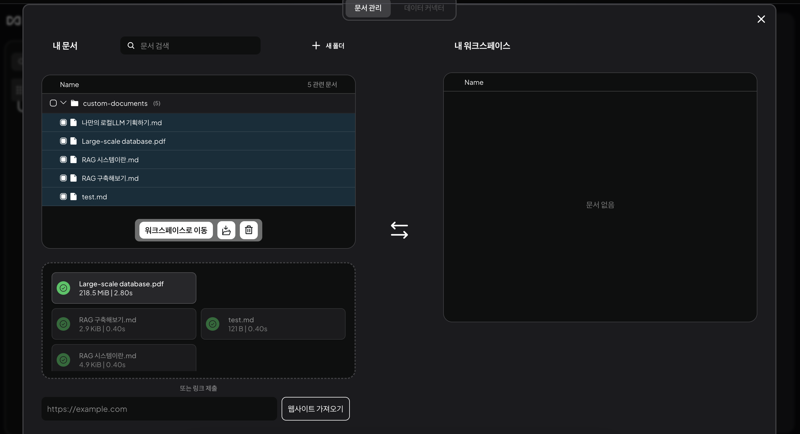
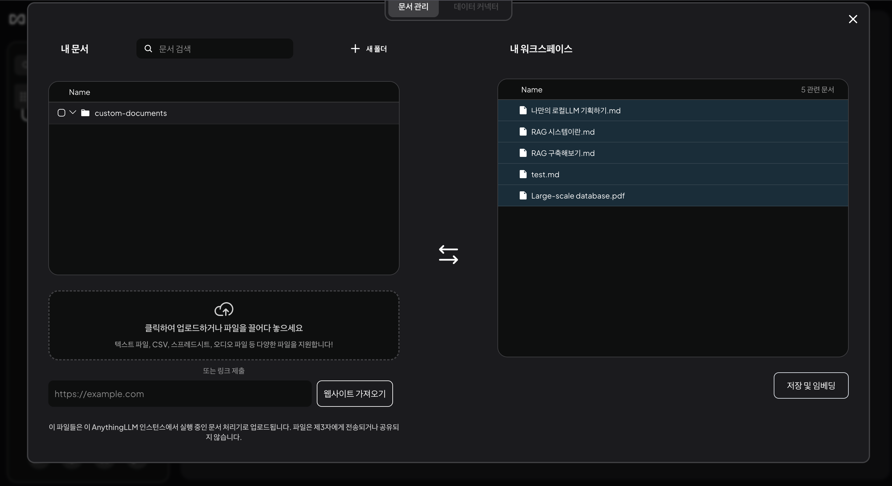
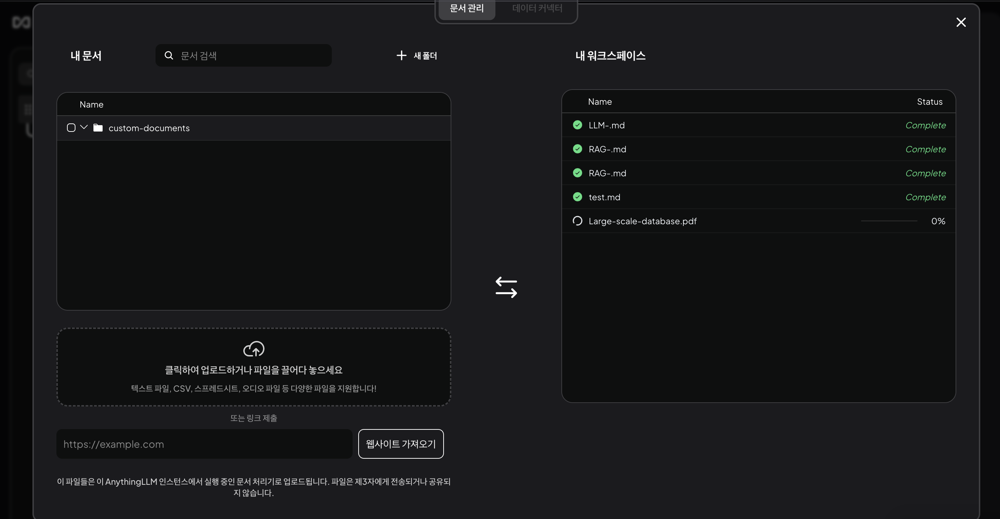
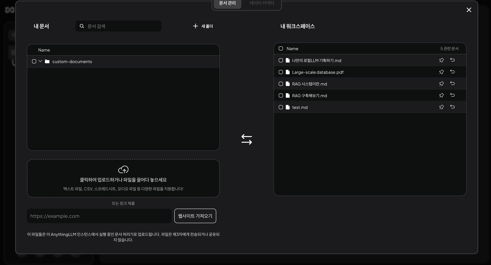

---

# 내가 업로드한 내용을 검색해보기

AnythingLLM에서는 현재 업로드된 모든 문서의 목록 및 요약을 **“document-summarizer” 또는 “rag-memory”** 도구를 사용해 확인할 수 있다. 
```
document-summarizer.list 
```
```
document-summarizer.summarize
```
Anythingllm에 '내가 업로드한 문서를 알려줘' 라고 프롬프트를 입력해 보았다. 분명 5개의 문서를 임베딩했는데 2개의 문서만이 답변되었다.
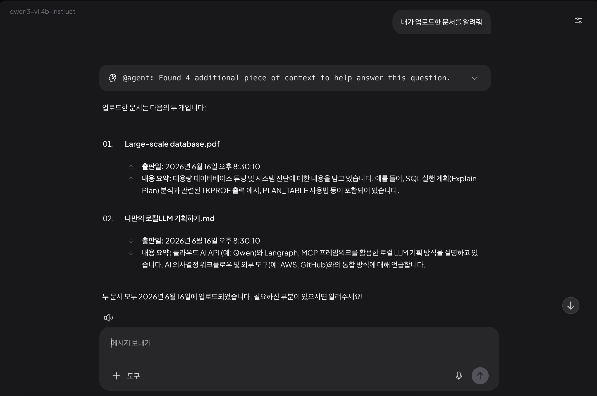


#질문 왜 5개의 문서를 임베딩했는데, 2개의 문서만 업로드 되었다고 할까?
#답변 AnythingLLM에서 꽤 자주 발생하는 현상이고, **버그라기보다는 LLM과 RAG의 동작 방식 때문**이다.
"내가 업로드한 문서를 알려줘"는 메타데이터(DB)를 조회하는 명령이 아니라, LLM이 검색된 문맥(Context)만 보고 추론해서 답변하는 것입니다. 그래서 문서 5개를 업로드했더라도 2개의 문서만 출력될 수 있습니다.
RAG의 관점에서 본다면 벡터 검색 결과에서 2개의 문서만 검색 결과로 반환 된 것.
```
사용자 -> 질문 -> 벡터 검색(RAG) -> 관련 문서 일부 검색 -> Qwen에게 전달 -> Qwen 답변
```

## 왜 2개만 검색됐을까?
1.  일부 문서는 임베딩 실패
2. 일부 문서는 Chunk 생성 실패
	문서가 빈 파일, 0바이트 파일, 깨진 PDF, OCR 실패 PDF인 경우 벡터 생성에 실패한다.
3. Agent Context 제한
	Agent는 Context Window를 절약하기 위해 일부 문서만 가져오는 경우가 있다.
4. "업로드 문서 목록"이라는 질문 자체가 애매함
	LLM 입장에서 "업로드 문서 목록" 을 "관련성이 높은 문서 일부"로 이해할 수도 있기 때문이다.

---

# AnythingLLM 사용 후기

anythingllm은 가볍도 보안에도 좋은 도구임이 확실하다.
하지만 몇 가지 허술한 부분이 있다.

1. 에이전트가 검색 및 답변하는 도중에는 사용자가 임의 중지할 수 없다.
2. 에이전트가 검색 및 답변하는 도중에 다른 스레드로 이동하면 기존 요청이 중지된다.
3. 처음 워크스페이스에서 문서들을 임베딩했으나 임베딩 안된 문서도 있었다. `Pin to Workspace` 를 설정하거나 다시 워크스페이스에서 재업로드를 하는 등 몇 차례 재시도를 하니 임베딩이 성공했다. 이런식이면 매번 문서를 임베딩 하고 엔진한테 문서가 정상적으로 업로드 되었는지 매번 확인해야 하는 번거로움이 생긴다.
4. '내가 업로드한 문서를 알려줘.' 프롬프트를 반복적으로 입력하니 답변이 이상하게 나오는 케이스가 발견되었다. 같은 질문을 계속 하니 엔진이 맛이 간 것 같다.
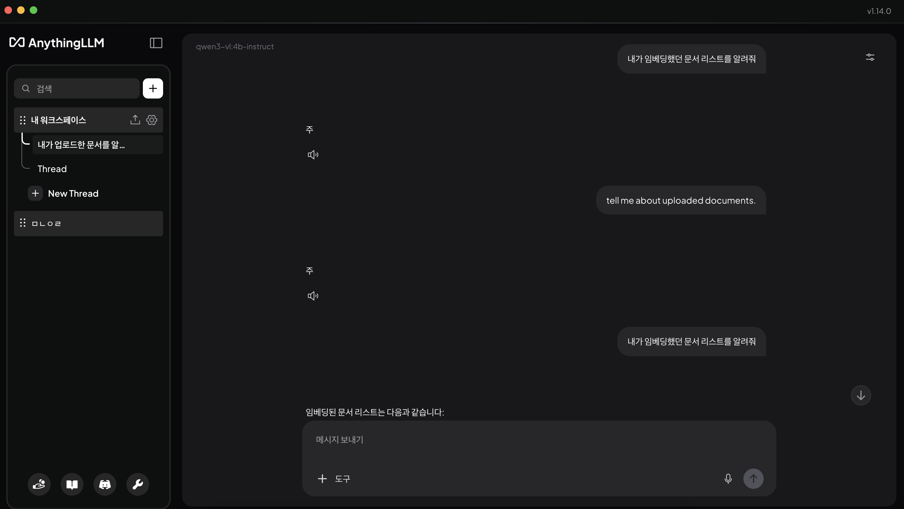
