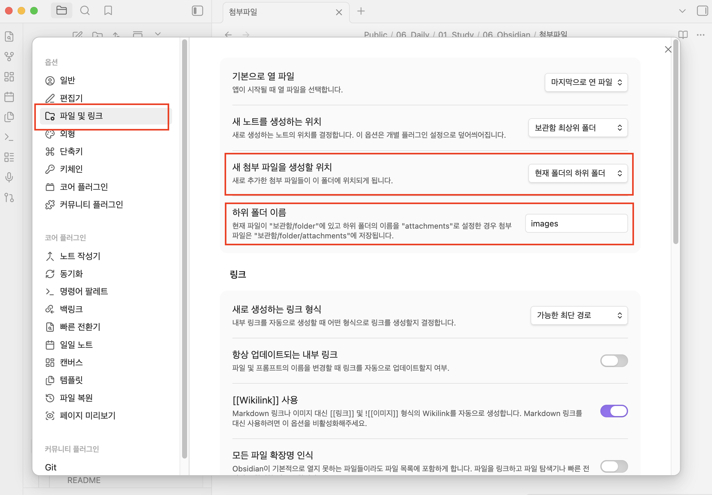

#Obsidian 

기본 설정에서는 노트에 이미지를 추가하면 최상위 경로에 이미지가 추가된다.
나는 각 폴더 하위에 images 폴더가 자동 생성하고 이미지들을 모아두고 싶었다.

해당 설정은 아래 경로로 이동 후 설정을 변경하면 된다.
1. 설정 - 옵션 - 파일 및 링크를 클릭한다.
2. 새 첨부 파일을 생성할 위치 : 현재 폰더의 하위 폴더
   하위 폴더 이름 : images

